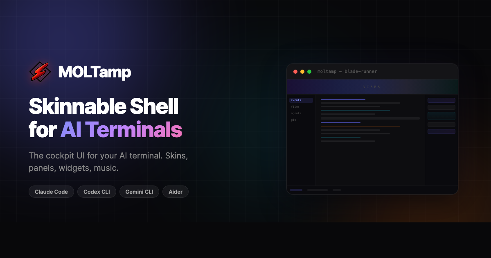

<div align="center">

<a href="https://moltamp.com">
  
</a>

<br/><br/>

[](LICENSE)
[](#browse-widgets)
[](https://moltamp.com/widgets/)

**[Download MOLTamp](https://moltamp.com)** &nbsp;&middot;&nbsp; **[Authoring Guide](WIDGETS.md)** &nbsp;&middot;&nbsp; **[Contributing](#contributing)**

</div>

<br/>

## What is MOLTamp?

MOLTamp wraps Claude Code's terminal in a skinnable cockpit UI — vibes panel, side panels, telemetry ticker, reactive animations. **Widgets** are self-contained HTML pages that run inside MOLTamp's panels. They can display data, respond to Claude's state, and match any skin's look automatically.

> Self-contained HTML. Full SDK access. Skin-aware by default.

<br/>

## Install a Widget

1. Download a widget `.zip` from this repo
2. In MOLTamp, open **Settings > Tabs > Import Widget...**
3. Select the `.zip` — done. It appears in your widget picker.

**Or manually:** unzip to `~/Moltamp/widgets/<category>/<widget-name>/` and restart.

<br/>

## Browse Widgets

| Widget | Category | Description |
|--------|----------|-------------|
| [System Stats](widgets/system-stats/) | System | Live CPU, memory, activity level, and shell state |

*Submit yours via PR.*

<br/>

## Build Your Own Widget

The full widget authoring guide lives in **[WIDGETS.md](WIDGETS.md)** — that's the single source of truth for building widgets.

**Quick version:** A widget is a folder with `widget.json` (manifest) and `index.html` (your widget). Widgets run in a sandboxed iframe with access to the `moltamp` SDK for IPC calls, store subscriptions, and settings persistence. All colors must use CSS theme variables (`var(--c-chrome-accent)`, etc.) so widgets look correct in every skin.

```
my-widget/
  widget.json       <- manifest (id + name required)
  index.html        <- bare HTML fragment (no <!doctype> wrapper)
  assets/           <- optional images, fonts
```

<br/>

## Contributing

1. Fork this repo
2. Add your widget to `widgets/<your-widget>/`
3. Include a screenshot in your widget's folder
4. Run through the [Pre-Submit Checklist](WIDGETS.md#checklist) in the authoring guide
5. Open a PR with a description of what it does

All widgets are reviewed for:
- Valid `widget.json` with unique `id`
- Correct `api` nesting in widget.json
- No hardcoded colors (uses theme variables)
- No external network requests
- Canvas uses resolved colors (not CSS variable strings)
- Bare HTML fragment (no document wrapper)
- Reasonable file sizes
- Works across multiple skins

<br/>

<div align="center">

<a href="https://moltamp.com">
  
</a>

<br/>

<sub>Made for the community by <a href="https://moltamp.com">MOLTamp</a></sub>

</div>
